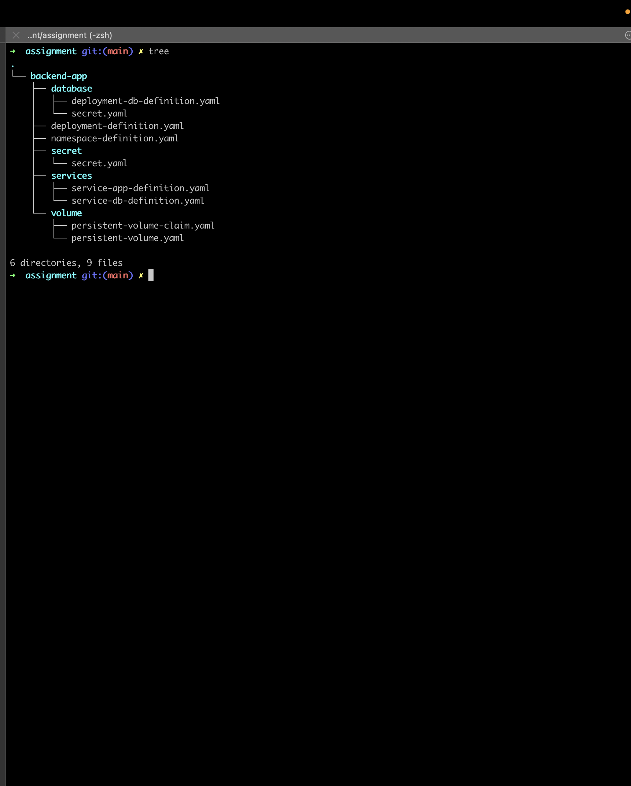
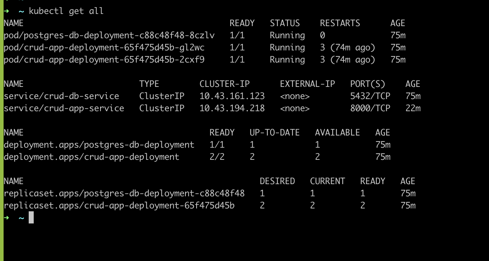

# rotc-final-assignment


Collaborators:
- Aayushi yadav aayushi.yadav@thoughtworks.com
- Swatipriya Chourasia swatipriya.c@thoughtworks.com


We have created
- Deployment pods for backend-app and database
- We have created secret
- volume and volume claim
- namespace named crud-app
- services for backend-app and db.


The directory structure



Resources



Useful commands
```
kubectl port-forward service/backend-api 8000:8000
curl -X GET http://localhost:8000/users
curl -X POST http://localhost:8000/users -d '{"name":"John Doe", "email":"jdoe@example.com"}' -H "Content-Type: application/json"
```


Pairing : Aayushi Yadav , Swatipriya Chourasia